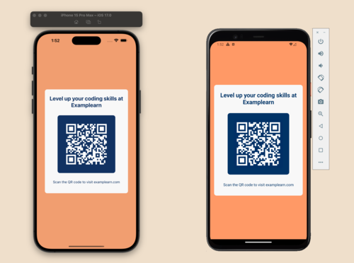

# QR Code Mobile Application

## Description

You will build a QR code mobile application in this project. The application will display a screen of a styled QR code on mobile devices that lead users to https://examplearn.com.

## Level

Beginner

## Tags

Mobile, Responsive, QR Code

## What you will build

You will build a QR code mobile application in this project. The application is only composed of a single screen for mobile devices. The screen is styled with a title, a QR code, and a subtext. The QR code will lead users to https://examplearn.com.

The screen should look consistent across different mobile devices. The screen should be responsive to different screen sizes as well. By building this project, you will learn how to structure and style a simple responsive mobile application.

## Where to start

To kick off this project, you can start with the following files:

- `design.md`: This file contains the design specification.
- `demo`: This folder contains a few demo images of the application.
- `images`: This folder contains all the images you need for this project.
- `fonts`: This folder contains all the fonts you need for this project.

## What else you need to know about this project

We recommend overwriting this `README.md` file with your own. To help you get started, we've provided [a template `README-template.md`](./README-template.md).

You have the admin access to this repository. You can push your code to this repository, or transfer this repository to your own GitHub account.

If possible, you should test your design on both iOS and Android devices.